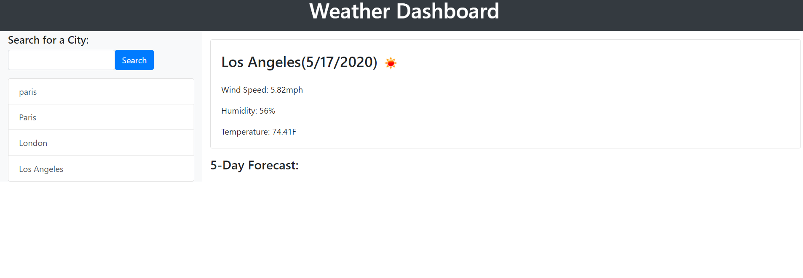

# Weather Dashboard

## Description
AS A traveler
I WANT to see the weather outlook for multiple cities
SO THAT I can plan a trip accordingly

Using Jquery, Javascript, and simple HTML, a weather app was developed. Inside this app, the user is able to insert any city into a working search bar, and see weather information for that city. The weather information provided was to include temperature, humidity, wind speed, and UV index. In order to successfully create this app, a URL along with an API key was needed within an ajax method. Each search entered is then stored in local storage so the user can come back at a later time & still will be able to see their previous searches. The search is cleared each day.  

## Usage
Here you can see a snippet of the Weather application. On the left there is a working search bar with the most recent searches, in the middle it shows the weather information for the current location you have chosen, and at the bottom is shows the 5 Day Forecast. Unfortunately, I was not able to append the 5 Day Forecast to the page correctly, even after spending some serious time working on the javascript.

## Installation
To use the Weather Dashboard App to find out specific weather attributes in your location of choice, click this link here:
https://shannontrainor.github.io/weather-dashboard/

### Credits
Open Weather Map APIs https://openweathermap.org/api
Bootstrap https://getbootstrap.com/